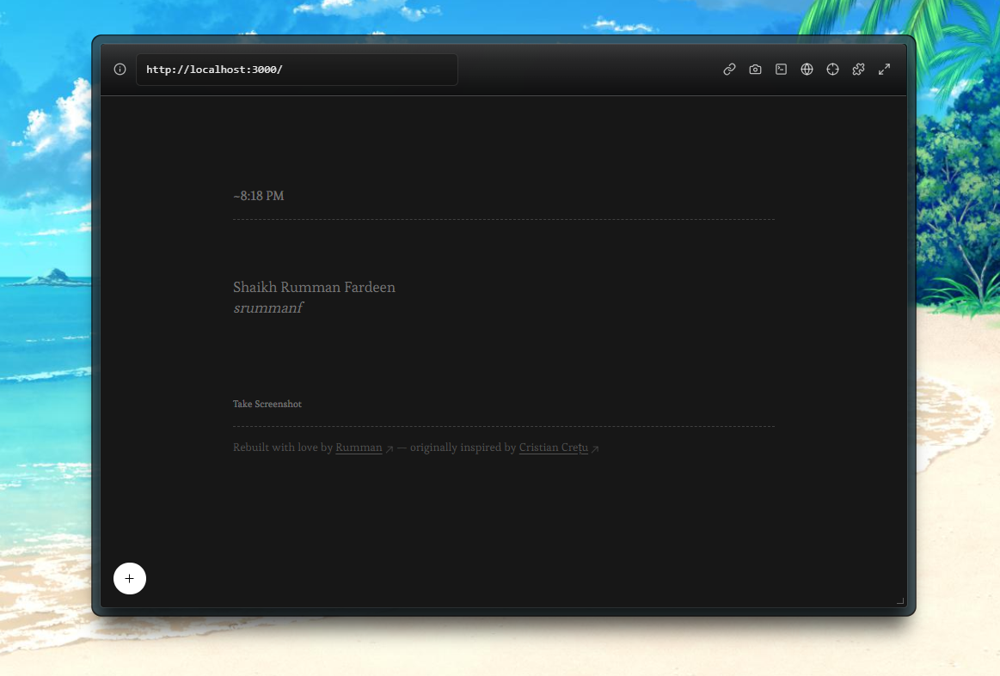

# **Pretty Browser View : Desktop Browser UI – A Draggable, Resizable Web Preview Interface**

---

## **Overview:**

This is a fully interactive, resizable, and draggable browser-like component built using NextJS. It simulates a lightweight operating system environment with a floating window that behaves like a modern browser. Users can input any valid URL—including `localhost` links—and view the page inside an `iframe`.

This project is designed to replicate real-world windowing behavior in the browser, enabling scenarios such as prototyping browser-based UI mockups, creating preview overlays, or building simulated OS experiences in React.

---

## **Key Features:**

1. **Live URL Preview (including localhost):**
   * Enter URLs like `https://example.com`, `http://localhost:3000`, or even IP-based URLs.
   * Loads the content into an `iframe` while respecting origin security policies.
2. **Draggable Window:**
   * Click and drag the top bar of the window to move it freely across the desktop background.
   * Dragging is smooth and interactive.
3. **Resizable Layout:**
   * Resize the window from any corner or edge.
   * Uses native HTML resizing or custom resize handles depending on implementation.
4. **Fullscreen Toggle:**
   * Switch the floating window to full-screen mode and back.
   * Useful for immersive previews or testing responsive designs.
5. **Desktop-style Background:**
   * Mimics an OS environment with a fixed background (solid color, gradient, or image).
   * Acts as the base canvas for all floating windows.

---

## **Tech Stack:**

* **NextJS**– Front-end UI logic and state management
* **TailwindCSS** – Utility-first styling for layout, spacing, and theming
* **HTML5 iframe API** – URL rendering in sandboxed, secure web containers
* **v0, chatGPT** – AI Assistance

---

## **Installation:**

**Prerequisites:**

* Node.js (version 16 or higher)
* npm or yarn (package manager)

**Steps:**

1. Clone the repository:
   `git clone https://github.com/srummanf/pretty-browser-view`
2. Navigate into the project:
   `cd pretty-browser-view`
3. Install dependencies:
   `npm install`
4. Start the development server:
   `npm run dev`
5. Open your browser and navigate to:
   `http://localhost:5173` (or whatever port your dev server chooses)

---

## **Component Behavior Details:**

**page.tsx (DesktopBrowser Component)**

* Accepts state for window position and dimensions
* Listens for drag events on the top bar
* Implements custom resize handlers or CSS resize
* Manages iframe `src` and error handling
* Includes buttons for fullscreen toggle and possibly close/minimize (optional)

---

### **Security Note (iframe sandboxing):**

Modern browsers restrict iframe access due to CORS and X-Frame-Options policies. Ensure you test only URLs that allow embedding. Localhost and internal tools typically allow it for development.

---

## **Use Cases:**

* OS simulation for browser UI prototypes
* Interactive design tool mockups
* Browser-based "apps" with custom UX
* Developer preview tool for embedded websites
* Teaching tool for frontend fundamentals

---

## Credits

* Inspired by the README.md file of this repository creative Instagram post ([View Github Repo](https://github.com/cristicretu/writer)), the idea was to design such a browser to visualize and capture simple mockup screenshots.

---

## Contribution

For guidelines on how to contribute to this project, please refer to the [Contribution Guide](./CONTRIBUTION.md).

---

## License

This project is released under the [MIT License](./LICENSE.md).

---

# A Great way to promote projects in your README file by taking a screenshot of the rendered product in the browser

---

<table>
  <tr>
    <td align="left" width="50%">
      <strong>Maintained by</strong> 
      Shaikh Rumman Fardeen 
      <a href="https://github.com/srummanf">GitHub: @srummanf</a> 
      <a href="mailto:rummanfardeen4567@gmail.com">rummanfardeen4567@gmail.com</a>
    </td>
    <td align="right" width="50%">
      <strong>Project Links</strong> 
      <a href="https://pretty-browser-view.vercel.app/">Live Demo</a> 
      <a href="https://github.com/srummanf/pretty-browser-view">Source Code</a> 
      <a href="./LICENSE">MIT License</a> | <a href="./CONTRIBUTING.md">Contributing</a>
    </td>
  </tr>
</table>
